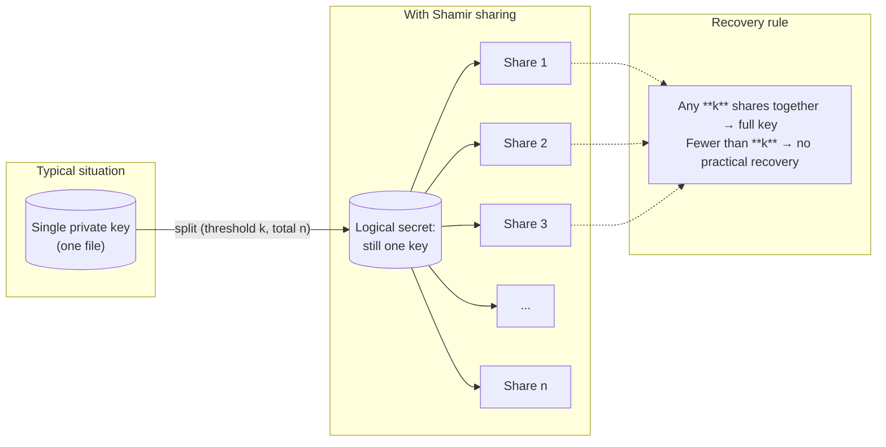
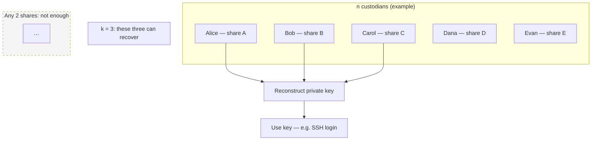
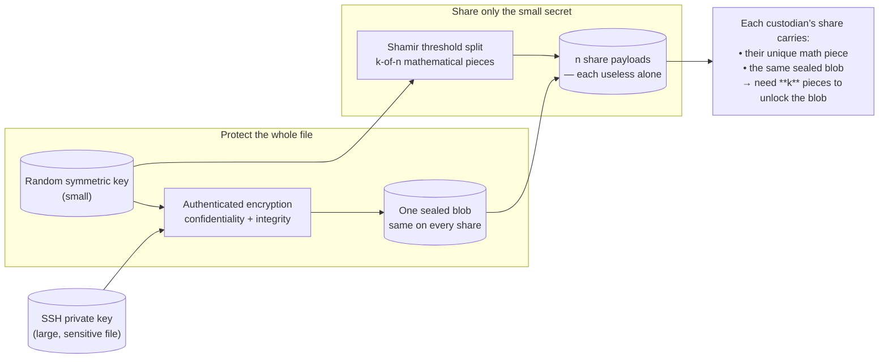
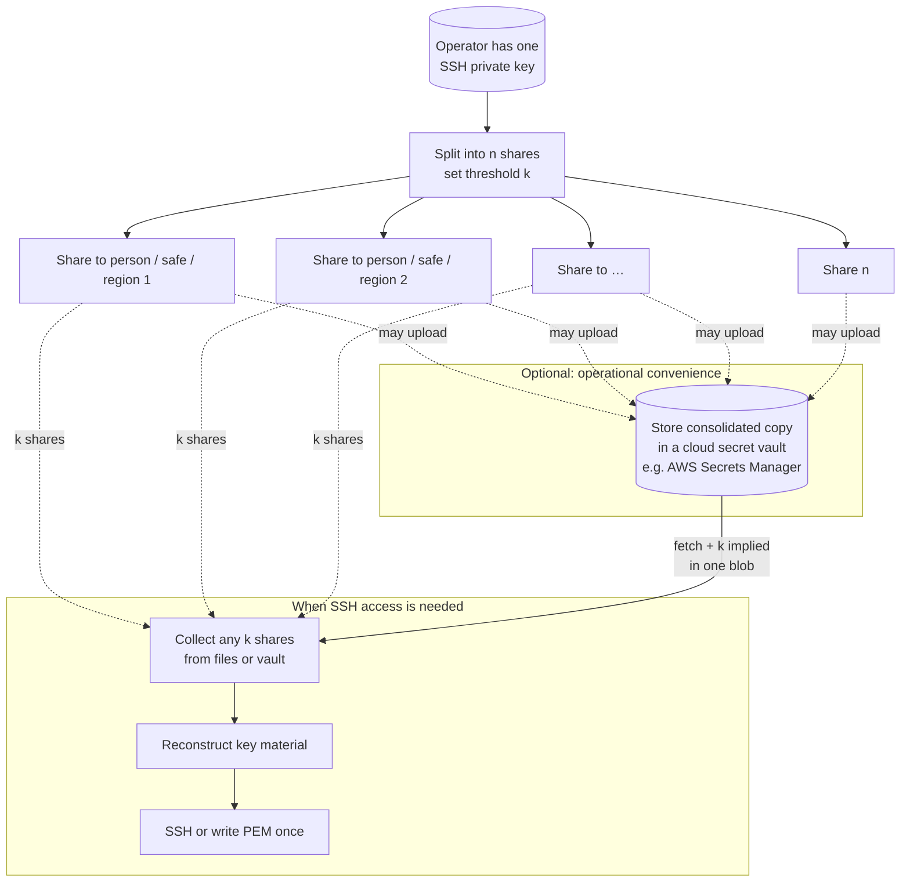
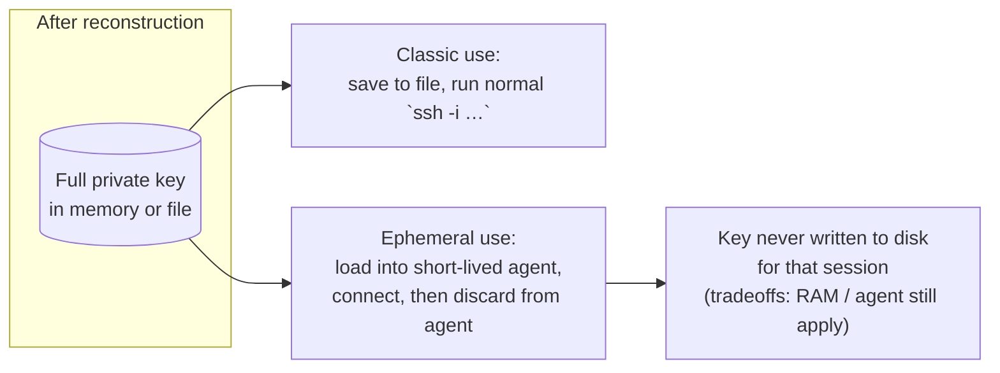
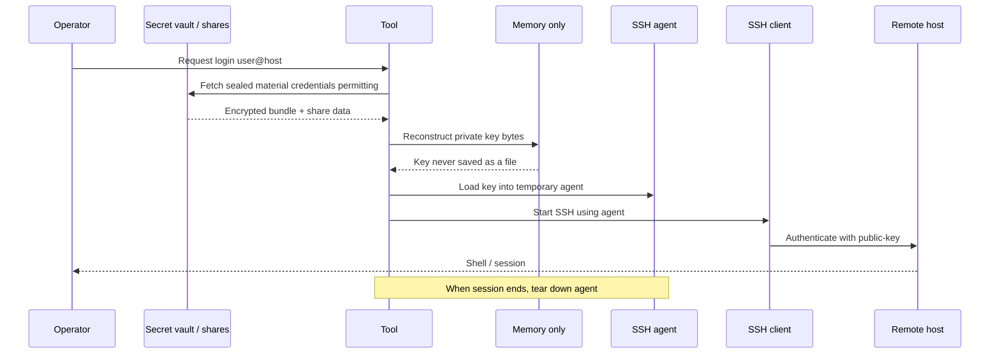
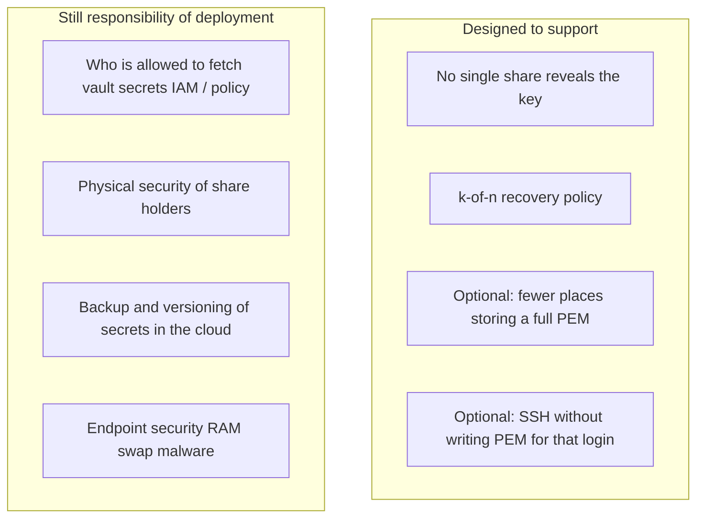
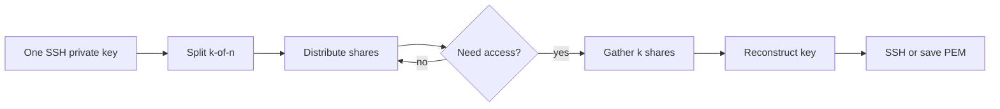

# shamir-ssh — conceptual flow (for slides and docs)

These diagrams explain **what** the system achieves and **how pieces relate**, not how the code is organized. Open in GitHub, VS Code (Mermaid preview), or [mermaid.live](https://mermaid.live) to export **PNG** / **SVG**.

---

## 1. The idea: from one fragile secret to k-of-n custody

**Message for an audience:** nobody needs to hold the whole key alone; compromise of fewer than *k* custodians does not reveal the key (under standard Shamir assumptions).

---

## 2. Threshold at a glance (k-of-n)

---

## 3. Why two layers: “protect the big blob, split the small key”

Conceptually the tool does **encrypt-then-share**:

**Message:** Shamir applies to a **short** secret (the symmetric key); the **entire** key file is encrypted so one field element is enough and the design stays standard.

---

## 4. Lifecycle: split → distribute → (optional) central store → recover

---

## 5. Two ways to use the recovered key

**Message:** the project supports **recovery to a file** or **one-shot SSH** where the key stays in memory for the session only.

---

## 6. Ephemeral SSH session (conceptual timeline)

---

## 7. Trust and scope (what this does / does not claim)

---

## 8. One-slide summary

---

*For implementation details (modules, CLI flags, formats), see the project README.*
